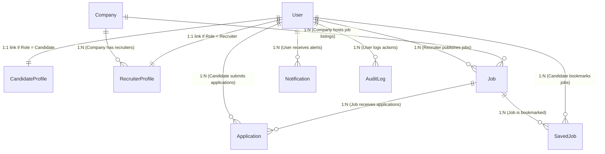

# JobSprint: Mongoose Models & Database Overview

This document describes the Mongoose schema architecture, folder structure, entity relationships, and query indexing strategies implemented for **JobSprint**.

---

## 1. Models Folder Structure

The schemas have been created in the backend's source directory using modern ES6 syntax:

```
JobSprint/
└── backend/
    └── src/
        └── models/
            ├── User.js              # Auth & core credentials
            ├── Company.js           # Verified employer entities
            ├── CandidateProfile.js  # Candidate resumes & histories
            ├── RecruiterProfile.js  # Recruiter association mappings
            ├── Job.js               # Job postings & criteria
            ├── Application.js       # ATS application submissions
            ├── SavedJob.js          # Bookmarked jobs (join collection)
            ├── Notification.js      # User alerts & messages
            └── AuditLog.js          # Operations security records
```

---

## 2. Collection Relationships

MongoDB is designed using a hybrid referenced/embedded model to strike a balance between query speed and write integrity:



### Relationship Breakdown
1. **User ↔ Candidate/Recruiter Profiles (1:1 Referenced)**
   * Linked via `userId` field. Profiles are stored in separate collections to keep the `Users` document lightweight for fast session token verification.
2. **Company ↔ RecruiterProfile (1:N Referenced)**
   * Multiple recruiters map back to a single verified `Company` entity via `companyId`. This enforces consistency for job board branding.
3. **Company ↔ Job (1:N Referenced)**
   * Jobs reference the `Company` collection via `companyId` for logo and website fetches. A virtual `jobs` field populate is defined in `Company.js` to look up all active opportunities.
4. **Job ↔ Application (1:N Referenced)**
   * Candidates apply to a job, generating an `Application` record containing a unique compound index (`jobId` + `candidateId`) to avoid duplicate submissions.
5. **SavedJob (Join Collection)**
   * Emulates a Many-to-Many relationship mapping `candidateId` and `jobId`. Enforces unique saves with compound indexes.

---

## 3. Database Indexing Strategy

Mongoose indexes are implemented to prevent unindexed collection scans (collscans) on critical, high-volume routes.

### Index Classifications

| Collection | Index Fields | Index Type | Query / Route Optimized |
| :--- | :--- | :--- | :--- |
| **Users** | `{ email: 1 }` | Single-field, Unique | Login & registration verification. |
| **Companies** | `{ name: 1 }` | Single-field, Unique | Company search and uniqueness validation. |
| **Companies** | `{ industry: 1 }` | Single-field | Employer listings filtering. |
| **CandidateProfiles** | `{ skills: 1 }` | Multikey | Recruiter searches matching candidate skill vectors. |
| **RecruiterProfiles** | `{ companyId: 1 }` | Single-field | Listing company team members. |
| **Jobs** | `{ status: 1, createdAt: -1 }` | Compound | Fetching active, paginated recent feeds. |
| **Jobs** | `{ companyId: 1, status: 1 }` | Compound | Loading public company landing job lists. |
| **Jobs** | `{ title: "text", description: "text" }` | Text | Text searches weighted towards the `title` field (weight 5). |
| **Applications** | `{ jobId: 1, candidateId: 1 }` | Compound, Unique | Preventing double application submits. |
| **Applications** | `{ jobId: 1, status: 1 }` | Compound | visual recruiter ATS status dashboard. |
| **Notifications** | `{ userId: 1, isRead: 1 }` | Compound | Counting and querying user unread messages. |
| **AuditLogs** | `{ userId: 1, createdAt: -1 }` | Compound | Admin security checks sorting actions. |

### Optimization Mechanics
* **Compound Sorting:** Indexes like `{ status: 1, createdAt: -1 }` ensure that when queries filter active jobs and sort chronologically, MongoDB reads directly from pre-sorted indices without performing an in-memory sort.
* **Compound Unique Index:** Index `{ jobId: 1, candidateId: 1 }` is verified at the database driver level, guaranteeing absolute integrity against concurrent application submission requests (double-clicks).
* **Text Index Weights:** Text indexing uses weights so matches on the Job Title are prioritized higher in search scoring than match hits inside the longer description field.
