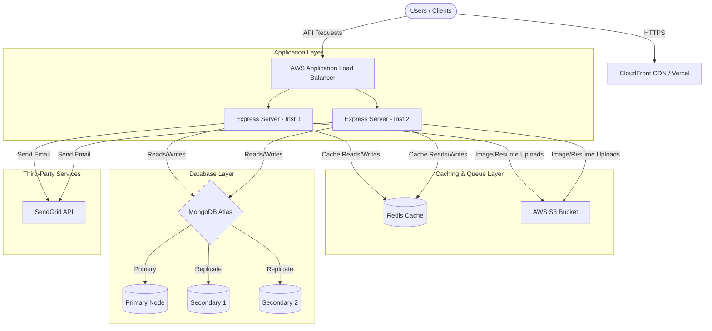
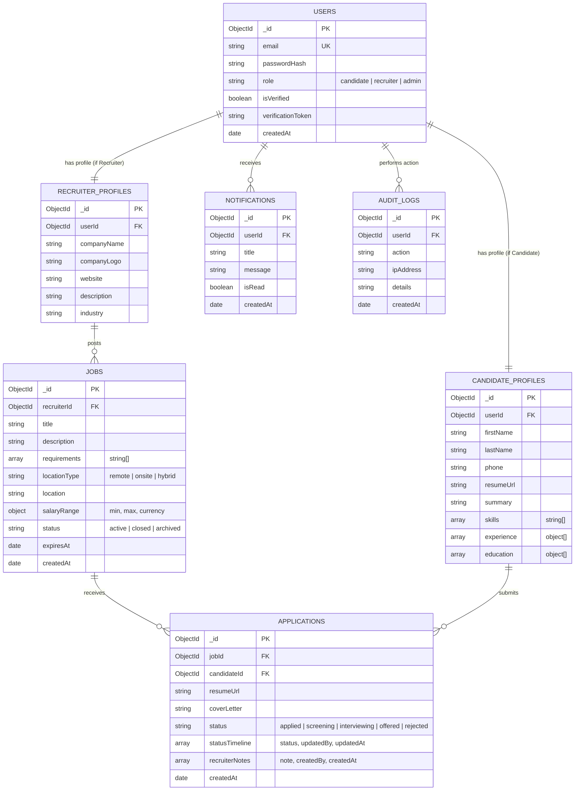
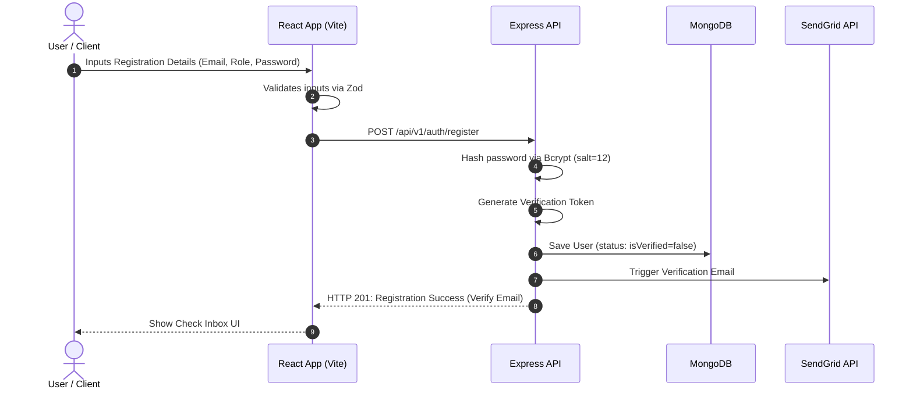
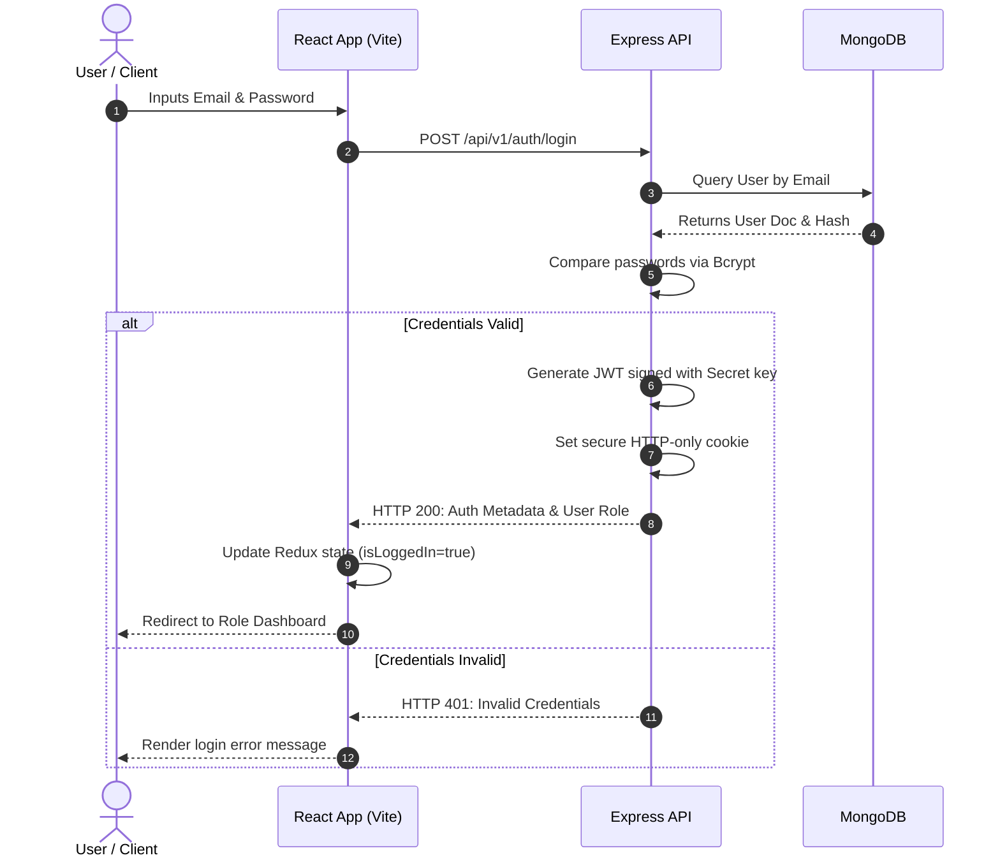
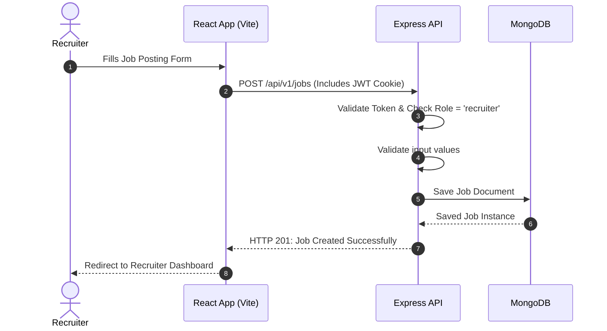
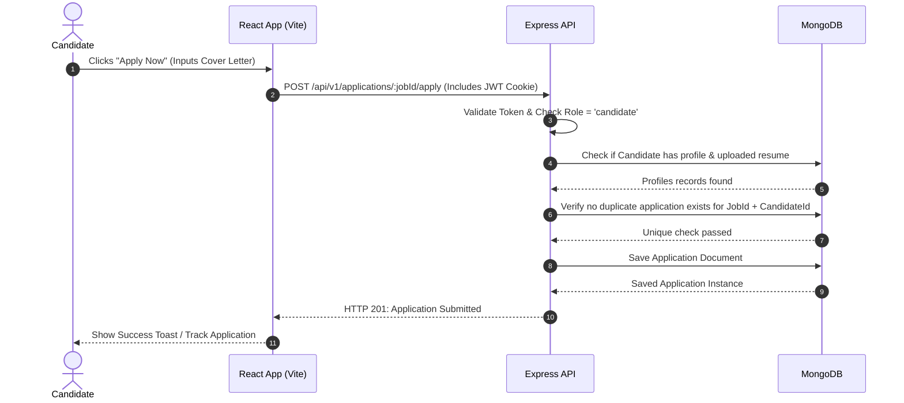
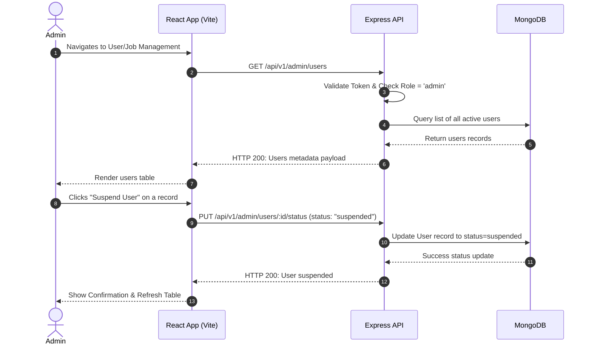

# Software Design Document: JobSprint (Job Portal Application)
**System Design & Project Blueprint**
**Author:** Senior MERN Stack Solution Architect
**Version:** 1.0.0
**Date:** June 12, 2026

---

## 1. Functional Requirements

### 1.1 Candidate Features
* **Authentication & Profiles:** Register, log in, reset password, social sign-on (optional). Build a detailed, searchable profile including contact info, professional summary, experience (work history), education, skills (tags), resume upload (PDF format, up to 5MB, stored on AWS S3/Cloudinary), and portfolio/social links.
* **Job Search & Discovery:** Multi-criteria job search (keyword, location, job type, salary range, industry). Advanced filters, sorting options, and full-text search capability.
* **Job Application:** One-click apply using saved profile details/resume or custom resume upload. Add a cover letter field for each application.
* **Application Tracker:** Personal dashboard tracking all applied jobs with their current status: *Applied, Screening, Interviewing, Offered, Rejected*.
* **Saved Jobs:** Toggle bookmarking for jobs of interest to review or apply for later.
* **Job Alerts & Notifications:** Email and in-app notifications for new job postings matching user-defined preferences, and application status updates.

### 1.2 Recruiter Features
* **Company Profile Management:** Manage company details, branding (logo, cover banner, description), website URL, industry sector, and team size.
* **Job Post Lifecycle Management:** Create, read, update, delete, open, close, and archive job posts. Set properties like title, description, requirements, skills, location (onsite/hybrid/remote), compensation range, and experience level.
* **Applicant Tracking System (ATS):** Visual kanban-style pipeline to transition candidates across stages (*Applied -> Screening -> Interviewing -> Offered/Rejected*). Add internal interviewer notes to applications.
* **Resume Book/Viewer:** View candidate profiles, download resumes directly, filter applicants by match score or skills.
* **Recruiter Dashboard:** Analytics on active job postings, total application counts, interview conversion rates, and views per posting.

### 1.3 Admin Features
* **User Management:** Monitor, suspend, verify, or delete Candidate and Recruiter accounts. Lock accounts after suspicious logins.
* **Job Moderation Panel:** Review job postings flagged by users or pending approval (if moderation is enabled). Delete jobs that violate Terms of Service.
* **Platform Configurations:** Manage skills taxonomies, industry sectors, default email templates, and application-wide settings.
* **Reporting & Analytics:** High-level platform metrics: active users daily/monthly, jobs posted, placement rates, revenue (if monetized), and system audit logs.

---

## 2. Non-Functional Requirements

### 2.1 Scalability
* **Horizontal Scaling:** Stateless Node/Express backend containerized using Docker, managed via an Orchestrator (AWS ECS/EKS) behind an Application Load Balancer (ALB).
* **Database Scaling:** MongoDB Atlas Replica Set (1 Primary, 2 Secondaries) with read preferences directed to secondaries for heavy search queries. Ready to shard by `companyId` or `location` if growth demands.
* **Caching Strategy:** Redis cache for fast read access to high-traffic static collections (e.g., job categories, industry listings, popular job posts).
* **Static Assets:** Resumes, company logos, and profile images stored in AWS S3 and served globally via CloudFront CDN.

### 2.2 Security
* **Session Management:** JSON Web Tokens (JWT) signed with HS256, transmitted via HTTP-only, Secure, and SameSite=Strict cookies to eliminate XSS-based token extraction and mitigate CSRF risks.
* **Access Control:** Strict Role-Based Access Control (RBAC) middleware verifying roles (`candidate`, `recruiter`, `admin`) at the router level.
* **Data Protection:** Passwords hashed using `bcrypt` (work factor of 12). Transport Layer Security (TLS 1.3) enforced for all transit data. Sensitive database fields (e.g., phone numbers or salaries, if required) encrypted at rest.
* **Vulnerability Mitigations:** Standardized middleware configurations:
  * `helmet` to set secure HTTP headers (CSP, HSTS).
  * `express-rate-limit` to block brute-force attacks.
  * NoSQL injection protection via query sanitization (`express-mongo-sanitize`).
  * XSS payload sanitization using input scrubbers.

### 2.3 Performance
* **Response Latency:** Primary API read endpoints should respond in < 150ms. Highly filtered search queries should respond in < 250ms under normal loads.
* **Frontend Performance:** SPA bundle sized < 250KB (gzipped) using route-based code splitting. Lighthouse Performance score of > 90.
* **Database Query Performance:** Database indexes mapped to every filterable field in query patterns. No unindexed collection scans allowed.

### 2.4 Availability
* **High Availability:** Minimum 99.9% uptime target. Multi-availability zone (Multi-AZ) deployment for ECS containers and MongoDB.
* **Health Checks:** `/health` endpoints implemented on backend services to enable container auto-healing and load balancer health routing.
* **Disaster Recovery:** Automated daily logical backups of MongoDB, retained for 30 days, with point-in-time recovery (PITR) active.

### 2.5 Maintainability
* **Code Standard & Structure:** Structured modular backend organization with strict MVC + Service Layer architecture. Strict TypeScript or clean modern ES6 Javascript.
* **Observability:** Centralized logging using `winston` and `morgan`, writing to standard output for container aggregation (e.g., CloudWatch, Datadog).
* **Testing Coverage:** Target of > 80% test coverage for critical business paths (authentication, application logic) using Jest/Supertest.

---

## 3. User Roles & Permissions

Below is the RBAC (Role-Based Access Control) matrix specifying system permissions:

| Module / Action | Guest (Unauth) | Candidate | Recruiter | Admin |
| :--- | :---: | :---: | :---: | :---: |
| View Job Search & Public Listings | Yes | Yes | Yes | Yes |
| Apply for Jobs | No | Yes | No | No |
| Manage Profile & Upload Resume | No | Yes | No | No |
| Manage Saved Jobs & Alerts | No | Yes | No | No |
| Create / Edit / Close Job Posts | No | No | Yes | Yes (Moderation) |
| Manage Company Profile | No | No | Yes | Yes |
| View Applicants & Move Pipeline | No | No | Yes | No |
| Write Internal Interview Notes | No | No | Yes | No |
| Verify / Suspend Users | No | No | No | Yes |
| Delete Flagged Jobs | No | No | No | Yes |
| Access System Audit Logs | No | No | No | Yes |

---

## 4. Detailed User Stories

### 4.1 Registration & Authentication
* **US-1.1:** *As a new user, I want to sign up with my email, password, and designated role (Candidate or Recruiter), so that I can access personalized features.*
  * **Acceptance Criteria:**
    * Validates unique email address.
    * Enforces password strength rules (min 8 chars, 1 uppercase, 1 lowercase, 1 special character).
    * Password must be saved hashed.
    * Requires email verification before full system access is granted.
* **US-1.2:** *As a registered user, I want to sign in with my email and password, so that I can access my secure portal.*
  * **Acceptance Criteria:**
    * Issue secure HTTP-only cookie with JWT upon successful validation.
    * Return token expiration, user metadata, and user role.
    * Lock account temporarily after 5 consecutive failed attempts.

### 4.2 Job Posting (Recruiters)
* **US-2.1:** *As a recruiter, I want to create a new job post specifying details like title, role, company, salary range, location, and requirements, so that candidates can apply.*
  * **Acceptance Criteria:**
    * Form input validations prevent blank values on mandatory fields.
    * Recruiter must belong to an active, verified company account.
    * New jobs default to `active` status.

### 4.3 Job Search (Candidates & Guests)
* **US-3.1:** *As a job seeker, I want to search for jobs using keywords, location, type, and experience level, so that I can find opportunities matching my goals.*
  * **Acceptance Criteria:**
    * Searches matching terms in `title`, `description`, and `skills`.
    * Implements pagination (default 10 results per page) to optimize rendering speed.

### 4.4 Job Application (Candidates)
* **US-4.1:** *As a candidate, I want to apply for a job post with my profile details and an optional cover letter, so that the hiring manager can review my profile.*
  * **Acceptance Criteria:**
    * Restricts candidates from applying to the same job multiple times.
    * Automatically captures application timestamp.
    * Triggers notification to the recruiter.

### 4.5 Profile Management
* **US-5.1:** *As a candidate, I want to upload my resume in PDF format, so that it is attached to all my applications.*
  * **Acceptance Criteria:**
    * Enforces a maximum file size of 5MB.
    * Standardizes file naming structure on S3 to prevent collisions.

### 4.6 Admin Operations
* **US-6.1:** *As an admin, I want to view a dashboard listing flagged jobs and user statistics, so that I can moderate the platform and keep it safe.*
  * **Acceptance Criteria:**
    * Show live counts of active jobs, applications, and flagged content.
    * Provide buttons to suspend users or ban job postings immediately.

---

## 5. System Architecture

### 5.1 High-Level Architecture Diagram
The platform is designed to handle high concurrency, decoupling frontend assets, API workloads, and databases.



### 5.2 Frontend Architecture (React)
The frontend utilizes a client-side routing model using standard modules:
* **UI Foundation:** Single Page Application (SPA) initialized via Vite with React.
* **State Management:** `Redux Toolkit` (or lightweight `Zustand`) handles global state (authentication status, active user profile metadata, global notifications). Local UI states are managed via React `useState` and `useReducer`.
* **Routing:** `React Router v6` with custom route protection wrappers (`ProtectedRoute` checking for roles: `CandidateRoute`, `RecruiterRoute`, `AdminRoute`).
* **API Layer:** `Axios` instance configured with base URL, timeout limits, and response interceptors. The interceptors parse HTTP 401 statuses to trigger automatic token refresh workflows or redirect to the login page.
* **Form & Validation:** React Hook Form coupled with Zod resolvers for light, performant, and reliable client-side input validations.

### 5.3 Backend Architecture (Express & Node.js)
Following clean architecture paradigms, the backend is organized into horizontal layers:
```
           +--------------------------------------------+
           |               Client Request               |
           +--------------------------------------------+
                                 |
                                 v
           +--------------------------------------------+
           |               Routing Layer                |
           +--------------------------------------------+
                                 |
                                 v
           +--------------------------------------------+
           |             Middleware Layer               | (Auth, Rate Limiting, Validation)
           +--------------------------------------------+
                                 |
                                 v
           +--------------------------------------------+
           |             Controller Layer               | (Request Parsing & Response Formatting)
           +--------------------------------------------+
                                 |
                                 v
           +--------------------------------------------+
           |              Service Layer                 | (Core Business Logic, DB Tx management)
           +--------------------------------------------+
                                 |
                                 v
           +--------------------------------------------+
           |       Data Access Layer (Mongoose)         | (Schema Definitions & Query Execution)
           +--------------------------------------------+
```

### 5.4 Database Architecture
* **DBMS:** MongoDB, chosen for its schema flexibility (polymorphic candidate/recruiter profiles, dynamic job requirements list) and rich indexing structures.
* **Write Pattern:** Primary write operations are handled by the Primary node, with automatic replication to Secondary nodes.
* **Consistency:** Default write concern set to `w: 1` or `w: majority` for critical actions (e.g., job applications, user registration).

---

## 6. Database Design

### 6.1 ER Diagram
Below is the relational mapping of MongoDB documents using foreign key-style ObjectIDs:



### 6.2 Collections Schema Specifications

#### 6.2.1 Users Collection
```json
{
  "_id": "ObjectId",
  "email": "String (unique, indexed)",
  "passwordHash": "String",
  "role": "String (enum: ['candidate', 'recruiter', 'admin'])",
  "isVerified": "Boolean (default: false)",
  "verificationToken": "String (optional)",
  "passwordResetToken": "String (optional)",
  "passwordResetExpires": "Date (optional)",
  "createdAt": "Date",
  "updatedAt": "Date"
}
```

#### 6.2.2 Candidate Profiles Collection
```json
{
  "_id": "ObjectId",
  "userId": "ObjectId (reference to Users, indexed, unique)",
  "firstName": "String",
  "lastName": "String",
  "phone": "String",
  "resumeUrl": "String (S3 URL)",
  "summary": "String",
  "skills": ["String (indexed)"],
  "experience": [
    {
      "company": "String",
      "position": "String",
      "startDate": "Date",
      "endDate": "Date",
      "current": "Boolean",
      "description": "String"
    }
  ],
  "education": [
    {
      "institution": "String",
      "degree": "String",
      "fieldOfStudy": "String",
      "startDate": "Date",
      "endDate": "Date"
    }
  ],
  "portfolioLinks": {
    "github": "String",
    "linkedin": "String",
    "website": "String"
  }
}
```

#### 6.2.3 Recruiter Profiles Collection
```json
{
  "_id": "ObjectId",
  "userId": "ObjectId (reference to Users, indexed, unique)",
  "companyName": "String (indexed)",
  "companyLogo": "String",
  "website": "String",
  "description": "String",
  "industry": "String",
  "companySize": "String"
}
```

#### 6.2.4 Jobs Collection
```json
{
  "_id": "ObjectId",
  "recruiterId": "ObjectId (reference to Users/RecruiterProfiles, indexed)",
  "title": "String (indexed)",
  "description": "String",
  "requirements": ["String"],
  "skillsRequired": ["String (indexed)"],
  "locationType": "String (enum: ['remote', 'onsite', 'hybrid'])",
  "location": "String (indexed)",
  "salaryRange": {
    "min": "Number",
    "max": "Number",
    "currency": "String (default: USD)"
  },
  "jobType": "String (enum: ['full-time', 'part-time', 'contract', 'internship'])",
  "status": "String (enum: ['active', 'closed', 'archived'], default: 'active', indexed)",
  "expiresAt": "Date",
  "createdAt": "Date",
  "updatedAt": "Date"
}
```

#### 6.2.5 Applications Collection
```json
{
  "_id": "ObjectId",
  "jobId": "ObjectId (reference to Jobs, indexed)",
  "candidateId": "ObjectId (reference to Users/CandidateProfiles, indexed)",
  "resumeUrl": "String (Snapshot of resume at apply time)",
  "coverLetter": "String",
  "status": "String (enum: ['applied', 'screening', 'interviewing', 'offered', 'rejected'], default: 'applied')",
  "statusTimeline": [
    {
      "status": "String",
      "updatedBy": "ObjectId",
      "updatedAt": "Date"
    }
  ],
  "recruiterNotes": [
    {
      "note": "String",
      "createdBy": "ObjectId",
      "createdAt": "Date"
    }
  ],
  "createdAt": "Date",
  "updatedAt": "Date"
}
```

### 6.3 Indexing Strategy

To maintain sub-200ms query performance as collections scale, the following MongoDB indexes will be built:

| Collection | Index Fields | Index Type | Purpose / Query Optimized |
| :--- | :--- | :--- | :--- |
| **Users** | `{ "email": 1 }` | Single Field, Unique | Login & Registration uniqueness checks |
| **CandidateProfiles** | `{ "userId": 1 }` | Single Field, Unique | Fetching profile details during session initialization |
| **CandidateProfiles** | `{ "skills": 1 }` | Multikey Index | Recruiter search for candidates by skill |
| **RecruiterProfiles** | `{ "userId": 1 }` | Single Field, Unique | Fetching recruiter/company details |
| **Jobs** | `{ "status": 1, "createdAt": -1 }` | Compound Index | Feed generation for active/recent job listings |
| **Jobs** | `{ "title": "text", "description": "text" }` | Text Index | Fuzzy search matches on titles/descriptions |
| **Jobs** | `{ "status": 1, "location": 1, "skillsRequired": 1 }` | Compound Index | Filtered search optimizations |
| **Applications** | `{ "jobId": 1, "status": 1 }` | Compound Index | Recruiter pipeline views per job |
| **Applications** | `{ "candidateId": 1, "createdAt": -1 }` | Compound Index | Candidate dashboard application feed |
| **Applications** | `{ "jobId": 1, "candidateId": 1 }` | Compound Index, Unique | Preventing duplicate applications |

---

## 7. REST API Design

All API requests are prefixed with `/api/v1`. Responses conform to a standard envelope structure:
* **Success:** `{ "success": true, "data": { ... }, "message": "Optional message" }`
* **Error:** `{ "success": false, "error": { "code": "ERROR_CODE", "message": "Human readable reason", "details": [ ... ] } }`

### 7.1 Authentication APIs (`/api/v1/auth`)

#### `POST /register`
* **Access:** Public
* **Request Body:**
  ```json
  {
    "email": "candidate@jobsprint.com",
    "password": "StrongPassword123!",
    "role": "candidate"
  }
  ```
* **Success Response (201 Created):**
  ```json
  {
    "success": true,
    "message": "Registration successful. Please verify your email.",
    "data": {
      "userId": "60c72b2f9b1d8b2bad18a221",
      "email": "candidate@jobsprint.com",
      "role": "candidate"
    }
  }
  ```

#### `POST /login`
* **Access:** Public
* **Request Body:**
  ```json
  {
    "email": "candidate@jobsprint.com",
    "password": "StrongPassword123!"
  }
  ```
* **Success Response (200 OK):**
  *(Sets an HTTP-only secure cookie named `token` containing the JWT)*
  ```json
  {
    "success": true,
    "message": "Login successful",
    "data": {
      "user": {
        "id": "60c72b2f9b1d8b2bad18a221",
        "email": "candidate@jobsprint.com",
        "role": "candidate"
      }
    }
  }
  ```

#### `POST /logout`
* **Access:** Authenticated (Candidate/Recruiter/Admin)
* **Success Response (200 OK):**
  *(Clears the `token` cookie)*
  ```json
  {
    "success": true,
    "message": "Logout successful"
  }
  ```

---

### 7.2 User Profile APIs (`/api/v1/users`)

#### `GET /profile`
* **Access:** Authenticated (Candidate/Recruiter)
* **Success Response (200 OK):**
  ```json
  {
    "success": true,
    "data": {
      "profile": {
        "_id": "60c72b2f9b1d8b2bad18a225",
        "userId": "60c72b2f9b1d8b2bad18a221",
        "firstName": "John",
        "lastName": "Doe",
        "skills": ["JavaScript", "React", "Node.js"],
        "resumeUrl": "https://s3.amazonaws.com/jobsprint/resumes/john_doe_resume.pdf"
      }
    }
  }
  ```

#### `PUT /profile`
* **Access:** Authenticated (Candidate or Recruiter)
* **Request Body (Candidate schema example):**
  ```json
  {
    "firstName": "John",
    "lastName": "Doe",
    "phone": "+1234567890",
    "skills": ["React", "Express", "MongoDB", "TypeScript"]
  }
  ```
* **Success Response (200 OK):**
  ```json
  {
    "success": true,
    "message": "Profile updated successfully",
    "data": {
      "profile": { ... }
    }
  }
  ```

#### `POST /resume/upload`
* **Access:** Authenticated (Candidate)
* **Request Body:** Multi-part Form Data containing file in `resume` field.
* **Success Response (200 OK):**
  ```json
  {
    "success": true,
    "message": "Resume uploaded successfully",
    "data": {
      "resumeUrl": "https://s3.amazonaws.com/jobsprint/resumes/60c72b2f9b1d8b2bad18a221-1686567300.pdf"
    }
  }
  ```

---

### 7.3 Job Lifecycle APIs (`/api/v1/jobs`)

#### `POST /`
* **Access:** Authenticated (Recruiter/Admin)
* **Request Body:**
  ```json
  {
    "title": "Senior Backend Engineer",
    "description": "Looking for a seasoned MERN stack architect...",
    "requirements": ["5+ years experience", "Deep knowledge of MongoDB indexing"],
    "skillsRequired": ["Node.js", "Express", "MongoDB"],
    "locationType": "hybrid",
    "location": "San Francisco, CA",
    "salaryRange": {
      "min": 120000,
      "max": 160000,
      "currency": "USD"
    },
    "jobType": "full-time"
  }
  ```
* **Success Response (201 Created):**
  ```json
  {
    "success": true,
    "message": "Job posting created successfully",
    "data": {
      "job": {
        "_id": "60c72b2f9b1d8b2bad18a250",
        "recruiterId": "60c72b2f9b1d8b2bad18a221",
        "title": "Senior Backend Engineer",
        "status": "active",
        "createdAt": "2026-06-12T09:54:59.000Z"
      }
    }
  }
  ```

#### `GET /` (with query filters)
* **Access:** Public
* **Query Parameters:** `page=1`, `limit=10`, `search=Backend`, `location=San Francisco`, `type=full-time`
* **Success Response (200 OK):**
  ```json
  {
    "success": true,
    "data": {
      "jobs": [
        {
          "_id": "60c72b2f9b1d8b2bad18a250",
          "title": "Senior Backend Engineer",
          "companyName": "TechCorp Solutions",
          "location": "San Francisco, CA",
          "salaryRange": { "min": 120000, "max": 160000 }
        }
      ],
      "pagination": {
        "currentPage": 1,
        "totalPages": 5,
        "totalJobs": 48
      }
    }
  }
  ```

#### `GET /:id`
* **Access:** Public
* **Success Response (200 OK):**
  ```json
  {
    "success": true,
    "data": {
      "job": {
        "_id": "60c72b2f9b1d8b2bad18a250",
        "title": "Senior Backend Engineer",
        "description": "Looking for a seasoned MERN stack architect...",
        "requirements": ["5+ years experience", "Deep knowledge of MongoDB indexing"],
        "locationType": "hybrid",
        "location": "San Francisco, CA"
      }
    }
  }
  ```

#### `PUT /:id`
* **Access:** Authenticated (Recruiter - Owner of Job / Admin)
* **Request Body:**
  ```json
  {
    "status": "closed"
  }
  ```
* **Success Response (200 OK):**
  ```json
  {
    "success": true,
    "message": "Job updated successfully",
    "data": { "job": { "id": "60c72b2f9b1d8b2bad18a250", "status": "closed" } }
  }
  ```

---

### 7.4 Job Application APIs (`/api/v1/applications`)

#### `POST /:jobId/apply`
* **Access:** Authenticated (Candidate)
* **Request Body:**
  ```json
  {
    "coverLetter": "I am excited to join the team..."
  }
  ```
* **Success Response (201 Created):**
  ```json
  {
    "success": true,
    "message": "Application submitted successfully",
    "data": {
      "application": {
        "_id": "60c72b2f9b1d8b2bad18a300",
        "jobId": "60c72b2f9b1d8b2bad18a250",
        "candidateId": "60c72b2f9b1d8b2bad18a221",
        "status": "applied",
        "createdAt": "2026-06-12T10:00:00.000Z"
      }
    }
  }
  ```

#### `GET /my-applications`
* **Access:** Authenticated (Candidate)
* **Success Response (200 OK):**
  ```json
  {
    "success": true,
    "data": {
      "applications": [
        {
          "_id": "60c72b2f9b1d8b2bad18a300",
          "job": {
            "title": "Senior Backend Engineer",
            "company": "TechCorp Solutions"
          },
          "status": "interviewing",
          "createdAt": "2026-06-12T10:00:00.000Z"
        }
      ]
    }
  }
  ```

#### `GET /job/:jobId`
* **Access:** Authenticated (Recruiter - Owner of Job)
* **Success Response (200 OK):**
  ```json
  {
    "success": true,
    "data": {
      "applications": [
        {
          "_id": "60c72b2f9b1d8b2bad18a300",
          "candidate": {
            "firstName": "John",
            "lastName": "Doe",
            "email": "john.doe@gmail.com",
            "resumeUrl": "https://s3.amazonaws.com/jobsprint/resumes/john_doe_resume.pdf"
          },
          "status": "applied"
        }
      ]
    }
  }
  ```

#### `PATCH /:id/status`
* **Access:** Authenticated (Recruiter - Owner of Job)
* **Request Body:**
  ```json
  {
    "status": "interviewing"
  }
  ```
* **Success Response (200 OK):**
  ```json
  {
    "success": true,
    "message": "Application status updated successfully",
    "data": {
      "applicationId": "60c72b2f9b1d8b2bad18a300",
      "status": "interviewing"
    }
  }
  ```

#### `POST /:id/notes`
* **Access:** Authenticated (Recruiter - Owner of Job)
* **Request Body:**
  ```json
  {
    "note": "Completed first-round technical interview. Strong JavaScript foundations."
  }
  ```
* **Success Response (201 Created):**
  ```json
  {
    "success": true,
    "message": "Note added successfully",
    "data": {
      "notes": [
        {
          "note": "Completed first-round technical interview. Strong JavaScript foundations.",
          "createdBy": "60c72b2f9b1d8b2bad18a221",
          "createdAt": "2026-06-12T10:30:00.000Z"
        }
      ]
    }
  }
  ```

---

### 7.5 Admin Moderation APIs (`/api/v1/admin`)

#### `GET /users`
* **Access:** Authenticated (Admin)
* **Success Response (200 OK):**
  ```json
  {
    "success": true,
    "data": {
      "users": [
        {
          "_id": "60c72b2f9b1d8b2bad18a221",
          "email": "candidate@jobsprint.com",
          "role": "candidate",
          "isVerified": true,
          "status": "active"
        }
      ]
    }
  }
  ```

#### `PUT /users/:id/status`
* **Access:** Authenticated (Admin)
* **Request Body:**
  ```json
  {
    "status": "suspended"
  }
  ```
* **Success Response (200 OK):**
  ```json
  {
    "success": true,
    "message": "User status updated successfully"
  }
  ```

---

## 8. Frontend Design & Interface Flow

To deliver a premium, high-impact user experience, JobSprint is designed with custom CSS variables, smooth state transitions, and responsive grid layouts.

### 8.1 Public Pages
* **Landing Page:** Features a bold, premium dark hero section with glassmorphic lookup bars, real-time counters showing system activity, and categories of trending domains.
* **Job Board / Listings:** Left-hand sticky collapsible filter pane. Center area contains paginated card layouts. Clicking a job card triggers a slide-in side drawer displaying job details, requirements, and an instant "Apply" form (on desktop) to maximize retention.
* **Auth Pages (Login/Sign-up):** Split screen style. Left side features a dynamic slider displaying testimonials or branding; right side contains clean forms with floating labels and micro-interaction validation feedback.

### 8.2 Candidate Portal
* **Candidate Dashboard:** Overview modules: Application Funnel Analytics (Visual progress chart of applications), Profile Completeness Meter, and interactive cards displaying "Recently Applied" and "Recommended Jobs".
* **Profile Builder:** Form structured into tabs (General Info, Experience, Education, Portfolio & Resume). Incorporates autosave triggers to ensure details are not lost during edits.
* **Applications Manager:** Tabbed lists filtering jobs by pipeline status (*Active, Offered, Rejected, All*), displaying full timeline tracking data per job.

### 8.3 Recruiter Workspace
* **Recruiter Dashboard:** High-level metrics: Active Postings, Application Count, New Profiles, Time-to-Hire, and views-over-time interactive line charts.
* **ATS Kanban Board:** Columns representing *Applied, Screening, Interviewing, Offered, Rejected*. Job applications are displayed as cards containing candidate contact data, matching scores, and resume links. Supports drag-and-drop actions to update statuses in real-time.
* **Job Creator Wizards:** Step-by-step forms with live preview capabilities showing how the job post will appear to candidates.

### 8.4 Admin Control Panel
* **Systems Board:** Line charts showing sign-up volumes, list tables with paginated access to flag queues, and inline quick-action toggles to suspend users or unpublish job listings immediately.

---

## 9. Folder Structure

Below is the complete MERN application structure, designed for clean separation of concerns:

```
JobSprint/
├── backend/
│   ├── src/
│   │   ├── config/             # DB, redis, mail service initializers
│   │   │   ├── db.js
│   │   │   ├── redis.js
│   │   │   └── aws.js
│   │   ├── controllers/        # Request handling and validation orchestrators
│   │   │   ├── authController.js
│   │   │   ├── userController.js
│   │   │   ├── jobController.js
│   │   │   ├── applicationController.js
│   │   │   └── adminController.js
│   │   ├── middlewares/        # Express request interrupters
│   │   │   ├── authMiddleware.js
│   │   │   ├── roleMiddleware.js
│   │   │   ├── errorMiddleware.js
│   │   │   ├── rateLimiter.js
│   │   │   └── uploadMiddleware.js
│   │   ├── models/             # Mongoose schemas & indexing rules
│   │   │   ├── User.js
│   │   │   ├── CandidateProfile.js
│   │   │   ├── RecruiterProfile.js
│   │   │   ├── Job.js
│   │   │   └── Application.js
│   │   ├── routes/             # REST route bindings
│   │   │   ├── authRoutes.js
│   │   │   ├── userRoutes.js
│   │   │   ├── jobRoutes.js
│   │   │   ├── applicationRoutes.js
│   │   │   └── adminRoutes.js
│   │   ├── services/           # Heavy-lifting business logic & integrations
│   │   │   ├── authService.js
│   │   │   ├── jobService.js
│   │   │   ├── s3Service.js
│   │   │   └── emailService.js
│   │   ├── utils/              # Generic helper functions
│   │   │   ├── validators.js
│   │   │   └── apiError.js
│   │   ├── app.js              # Express app definitions
│   │   └── server.js           # Server startup script
│   ├── tests/                  # Integration and Unit tests
│   │   ├── auth.test.js
│   │   └── job.test.js
│   ├── package.json
│   └── README.md
│
├── frontend/
│   ├── public/                 # Static public resources
│   │   └── assets/
│   ├── src/
│   │   ├── assets/             # Brand logos & background svgs
│   │   ├── components/         # Reusable presentation controls
│   │   │   ├── common/         # Button, Input, Modal, Loader
│   │   │   ├── layout/         # Header, Footer, Sidebar
│   │   │   └── jobs/           # JobCard, JobFilter, SlideDrawer
│   │   ├── context/            # React context providers (fallback states)
│   │   │   └── ThemeContext.js
│   │   ├── hooks/              # Custom reusable hooks (fetchers, scroll, etc.)
│   │   │   ├── useAuth.js
│   │   │   └── useFetch.js
│   │   ├── pages/              # Routing entry points
│   │   │   ├── Public/         # Home, JobList, JobDetails, Login
│   │   │   ├── Candidate/      # CandidateDashboard, AppliedJobs, Profile
│   │   │   ├── Recruiter/      # RecruiterDashboard, JobPostForm, ATSBoard
│   │   │   └── Admin/          # AdminDashboard, UserManagement
│   │   ├── services/           # Axios instance & API wrapper calls
│   │   │   ├── api.js
│   │   │   ├── jobService.js
│   │   │   └── authService.js
│   │   ├── store/              # Redux slices (Zustand stores)
│   │   │   ├── authSlice.js
│   │   │   └── store.js
│   │   ├── styles/             # Global CSS Variables & Styles
│   │   │   └── index.css       # Core design design system tokens
│   │   ├── utils/              # Date formats, text summaries
│   │   ├── App.jsx             # Main Router layout wrapper
│   │   └── main.jsx            # DOM renderer entry point
│   ├── package.json
│   ├── vite.config.js
│   └── index.html
```

---

## 10. Core Application Workflows

### 10.1 User Registration Flow
Candidates and Recruiters register and establish their session security environment:


### 10.2 User Login Flow


### 10.3 Job Posting Flow


### 10.4 Job Application Flow


### 10.5 Admin Moderation Flow


---

## 11. Security Design

The application implements defense-in-depth security strategies at the network, web server, and application layers:

### 11.1 JWT Authentication Architecture
1. **Payload contents:** Keep claims minimal to reduce bandwidth. Included parameters: `userId`, `role`. Expiration claims (`exp`) set to 1 hour.
2. **Token Transmission:** Transmitted via `Set-Cookie` header on login:
   ```http
   Set-Cookie: token=<jwt-token>; HttpOnly; Secure; SameSite=Strict; Path=/; Max-Age=3600
   ```
   * **HttpOnly:** Restricts access from Javascript (`document.cookie`), neutralizing Cross-Site Scripting (XSS) extraction risks.
   * **Secure:** Restricts cookie transmission to HTTPS connections only.
   * **SameSite=Strict:** Ensures cookies are only sent in first-party contexts, protecting against Cross-Site Request Forgery (CSRF).

### 11.2 Role-Based Access Control Middleware (Example Concept)
A flexible middleware validates routing access based on the user's role profile:
```javascript
// middleware/roleMiddleware.js
exports.authorizeRoles = (...allowedRoles) => {
  return (req, res, next) => {
    // req.user is populated by the authMiddleware from JWT validation
    if (!req.user || !allowedRoles.includes(req.user.role)) {
      return res.status(403).json({
        success: false,
        error: {
          code: 'FORBIDDEN',
          message: 'Access denied. You do not have permission to perform this action.'
        }
      });
    }
    next();
  };
};
```

### 11.3 Input Validation (Schema Enforcement)
Every public write API is validated before invoking controller actions using Zod schema schemas. This protects MongoDB from dirty data and code injection.
```javascript
// schemas/jobSchema.js
const { z } = require('zod');

exports.createJobSchema = z.object({
  body: z.object({
    title: z.string().min(3).max(100),
    description: z.string().min(10).max(5000),
    requirements: z.array(z.string().min(2)),
    locationType: z.enum(['remote', 'onsite', 'hybrid']),
    location: z.string().min(2),
    salaryRange: z.object({
      min: z.number().positive(),
      max: z.number().positive(),
      currency: z.string().length(3).default('USD')
    }),
    jobType: z.enum(['full-time', 'part-time', 'contract', 'internship'])
  })
});
```

---

## 12. Deployment Architecture

JobSprint is deployed using a decoupled, highly available infrastructure setup:

```
                  +-------------------------+
                  |    Route 53 (DNS)       |
                  +-------------------------+
                               |
                               v
                  +-------------------------+
                  |  AWS WAF (Web Firewall) |
                  +-------------------------+
                               |
                               v
                  +-------------------------+
                  |  Application Load Balancer|
                  +-------------------------+
                     /                     \
                    v                       v
      +------------------------+  +------------------------+
      |  Fargate ECS Instance  |  |  Fargate ECS Instance  |
      |   (Express API - AZ A) |  |   (Express API - AZ B) |
      +------------------------+  +------------------------+
              |           |                  |           |
              v           |                  v           |
      +---------------+   |          +---------------+   |
      | Redis Cache   |   |          | Redis Cache   |   |
      | (ElastiCache) |   |          | (ElastiCache) |   |
      +---------------+   |          +---------------+   |
              |           |                  |           |
              |           v                  |           v
              |   +-----------------------+  |   +-------------------+
              |   | MongoDB Atlas (Pri)   |  |   | MongoDB Atlas(Sec)|
              |   +-----------------------+  |   +-------------------+
              |               |              |             |
              +---------------+--------------+-------------+
```

### 12.1 Deployment Strategy
* **Frontend:** Built statically using Vite and hosted on Vercel or AWS S3 + CloudFront.
* **Backend:** Express API containerized with Docker and deployed to AWS ECS using Fargate. Undergoes automatic scaling when CPU usage exceeds 70%.
* **Database:** MongoDB Atlas (M10 cluster or higher) running in a multi-region configuration with automated backup retention.

### 12.2 Environment Variables (Configuration Matrix)

Create a secure `.env` file in the appropriate project folders. Never commit these secrets to version control.

#### Backend Env Template (`backend/.env.example`)
```env
# Application Settings
NODE_ENV=development
PORT=5000
API_URL=http://localhost:5000
FRONTEND_URL=http://localhost:5173

# Database Connections
MONGODB_URI=mongodb+srv://<username>:<password>@cluster0.mongodb.net/jobsprint?retryWrites=true&w=majority

# Security Secrets
JWT_SECRET=super_secret_high_entropy_signing_key_change_me_in_production
JWT_COOKIE_EXPIRES_IN=3600

# AWS Storage Configuration
AWS_ACCESS_KEY_ID=your_aws_access_key
AWS_SECRET_ACCESS_KEY=your_aws_secret_key
AWS_REGION=us-east-1
AWS_S3_BUCKET_NAME=jobsprint-static-assets

# Redis Connection
REDIS_HOST=127.0.0.1
REDIS_PORT=6379
REDIS_PASSWORD=

# Third-Party Integrations
SENDGRID_API_KEY=SG.your_sendgrid_api_key_here
FROM_EMAIL=no-reply@jobsprint.com
```

#### Frontend Env Template (`frontend/.env.example`)
```env
VITE_API_URL=http://localhost:5000/api/v1
```

---
*End of Software Design Document*
